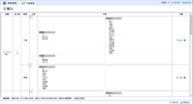
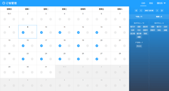

<!--
/**
 * @author dondevi
 * @create 2017-11-17
 */
-->

# Meal ordering System UI


## Compare

- Before

- After



## Example

<https://dondevi.github.io/meal-ordering-ui/dist/?mock>


## Develop

```shell
  # init
  $ npm run init

  # dev: http://localhost:8096/
  $ npm run dev

  # Build
  $ npm run dist
```

## Nginx
> `/etc/nginx/conf.d/(custom).conf`

```shell
  server {
      listen                  80;
      server_name             (server_name);
      location / {
          root                /home/(user)/projects/meal;
          index               index.html;
      }
      location /api-oa {
          proxy_pass          http://(server_host)/;
          proxy_redirect      off;
          proxy_set_header    Host $proxy_host;
          proxy_set_header    X-Real-IP $remote_addr;
          proxy_set_header    X-Forwarded-For $proxy_add_x_forwarded_for;
      }
  }
```
